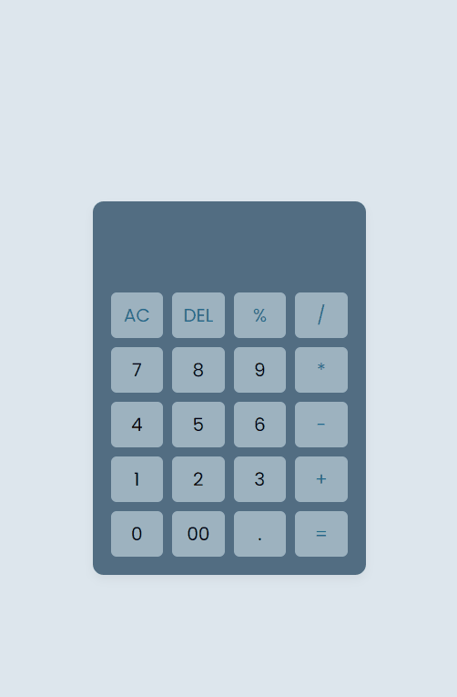

# Simple Calculator

This is a simple web-based calculator project built using HTML, CSS, and JavaScript.

## Overview

This project aims to provide a basic calculator with essential arithmetic operations, including addition, subtraction, multiplication, and division. It is a great way to practice and improve your front-end development skills while also building a practical tool.

## Features

- Addition, subtraction, multiplication, and division operations.
- Clear button to reset the calculator.
- A responsive and user-friendly interface.

## Usage

1. Clone the repository to your local machine:

2. Open the `index.html` file in your preferred web browser.

3. Start performing calculations using the on-screen buttons.

## Screenshots

## Contributing

If you'd like to contribute to this project, feel free to open an issue or create a pull request. Your input and improvements are always welcome!

---

**Happy calculating!**

Thank you for using and contributing to our calculator project. We hope you find it useful and enjoy the learning experience.
